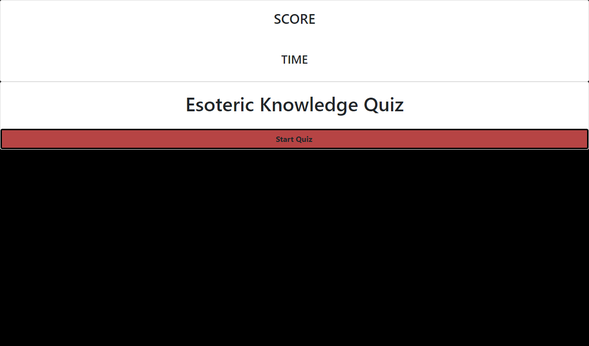
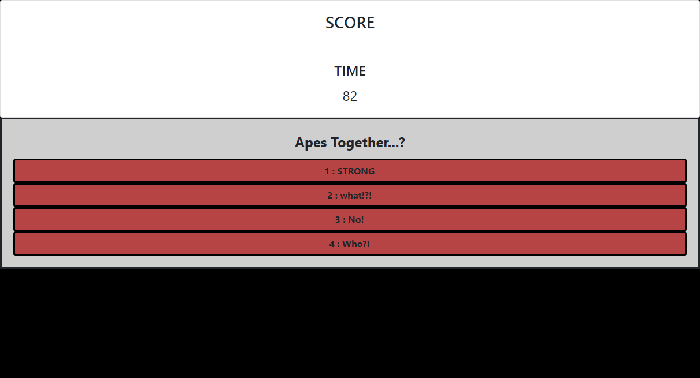

# **MR-TheQuiz.REDUX**

   

### **Navigation**

[Description](#description) / [screenshots](#screenshots) / [Questions](#questions)/ [Installation](#installation)

-------

## **Description** 
The client wanted a quiz to test their coding knowledge. But, then they changed their mind and wanted something a little more personal. The quiz is a reflection of their (my) wants. 

Features include: a point scoring system. A timer that counts down, with a 10sec penalty for incorrect answers. 

icebox: local storage and leaderboards.

--------

## **screenshots**

-----------

---------

## **Questions:**

### **What licenses are needed?**
There are no license requirements

### **Installation**
There are no installation requirements

### **Testing** 
There are no tests

### **Will it be maintained?** 
it will not be maintained

### **Can I contribute?** 
You cannot contribute

